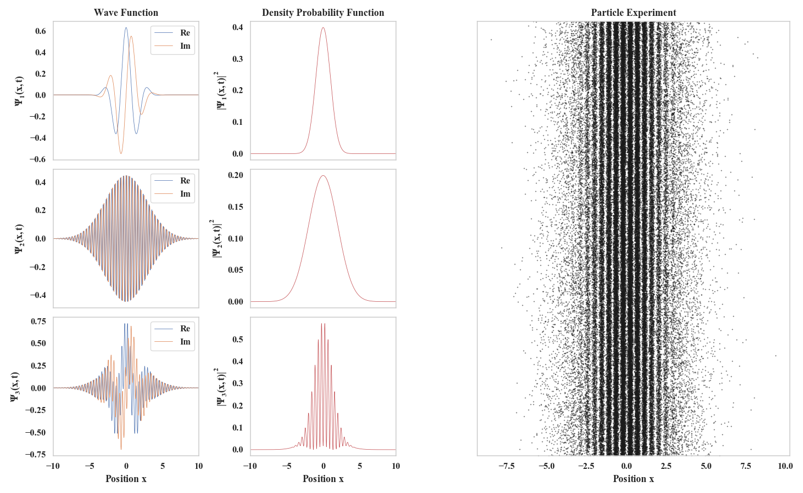

# Interference pattern

> An interference pattern can be achieved when two waves of similar frequencies intersect. In quantum physics this can be achieved with wave functions that describe the position of an electron, rendering the famous interpretation of a wave/particle duality. This is the principle that is usually shown in the double slit experiment, where two wave functions interact with each another and that a new renormalized wavefunction. This can be easily simulated by implementing the solution of a quantum system and slighty variating some of the parameters of the wave functions.

(See pdf for a complete visualization on Latex and the jupyther notebook for the code)

======

Quantum Mechanics was born due to the intimacy of the development of experimental research. It is now well known that the properties of atomic and sub atomic systems di?er widely from the macroscopic system’s properties. This is the case for the free particle. Classically we can think of a free particle as a body with a mass m at constant velocity, with no interaction of any potential. However, in quantum mechanics the free particle can carry any energy, nevertheless, there is no such thing as a free particle with a de?nite energy. Superpositions of wave packets lead to interference which allows localization and normalizability.

======

It is possible to obtain a general wave function from the Schrödinger equation’s solution of a free particle: 

$$\Psi = \left(2\pi \sigma^2\right)^{-1/4}\frac{\sigma}{\sqrt{\sigma^2+ \frac{i\hbar t}{2m\sigma}}}e^{-\frac{(x-x_0-2i\sigma^2k_0)^2}{4\sqrt{\sigma^2+ \frac{i\hbar t}{2m\sigma}}}-\sigma^2k_0^2+ik_0x}
$$

One can graph this function an position $x$ indicated for N points with a range from _b_ to _a_ and giving the necessary parameters $t$, $x_0$, $\sigma$, and $k_0$.

In this case, the general parameters were defined as following:

$$
x\in[a,b]=[-10,10];\quad N=1000
$$

======

By evaluating the function with the following parameters, a graph corresponding to the real and imaginary components can be created. 
$$
t=0;\quad x_0=0;\quad \sigma=1.5;\quad k_0 = 1.5
$$

By evaluating the function with similar parameters, another graph can be generated.
$$
t=0;\quad x_0=0;\quad \sigma=2.0;\quad k_0 = 6.0
$$

Given that two wave-functions can be in a superposition state, it is possible to obtain a third wave-function that is a linear combination of the last two.

To do this, a new wave-function can be created with the condition of re-normalization. 

$$
\Psi_3 = \frac{1}{\sqrt{2}}\left(\Psi_1-\Psi_2\right)
$$

To determine the probability to find a particle in this state, the squared magnitude of the wave-function can be obtained, this actually yields a probability density function.

In some cases, it is possible to find an interference pattern in the probabilities due to the superposition of different quantum states.

Considering the probability density function of the third wave-function, an experiment can be realized.

The behavior of the particles can be tested by overlapping the probability density function with the results.